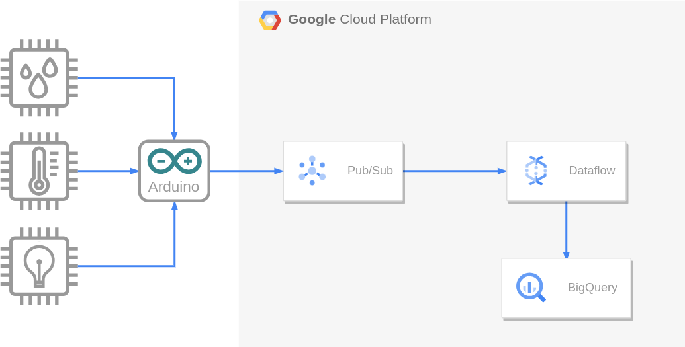

# Streaming de Dados de sensores

Este projeto tem como objetivo coletar dados de sensores de luminosidade, temperatura ambiente e umidade relativa do ar usando um Arduino e enviar esses dados para o BigQuery (GCP) usando o Google Pub/Sub e Dataflow.

## Arquitetura do projeto

## Montagem do circuito

## Estrutura do Projeto

O projeto é composto por quatro componentes:

### 1. Configuração do GCP

- **main.sh:** Shell Script para criar um tópico e uma assinatura no GCP Pub/Sub.

### 2. Leitura dos dados dos sensores

- **sensor_read.ino:** Script a ser carregado no Arduino para a leitura dos valores dos sensores.

### 3. Envio de Dados para o GCP

- **publish.py:** Script em Python para ler dados da porta serial do Arduino e publicá-los no tópico do GCP Pub/Sub.

### 4. Processamento de Dados no GCP

- **dataflow.py:** Script em Python usando Apache Beam para processar dados (Usando Dataflow) a partir da assinatura do Pub/Sub e armazená-los no BigQuery.

## Executando o Projeto

1. **Configuração do GCP:**
   - Faça as alterações desejadas para os nomes do Tópico, Assinatura e nomes de tabelas;
   - Execute o script `main.sh` para criar o tópico e a assinatura no GCP Pub/Sub.
  
2. **Leitura dos dados dos sensores:**
   - Realize a conexão do Arduino na porta USB do computador;
   - Carregue o script `sensor_read.ino` no Arduino.

3. **Envio de Dados para o GCP:**
   - Execute o script `publish.py` para ler dados da porta serial do Arduino e publicá-los no tópico do GCP Pub/Sub.

4. **Processamento de Dados no GCP:**
   - Execute o script `dataflow.py` para processar os dados e os armazenar no BigQuery.

## Requisitos

## Observações

